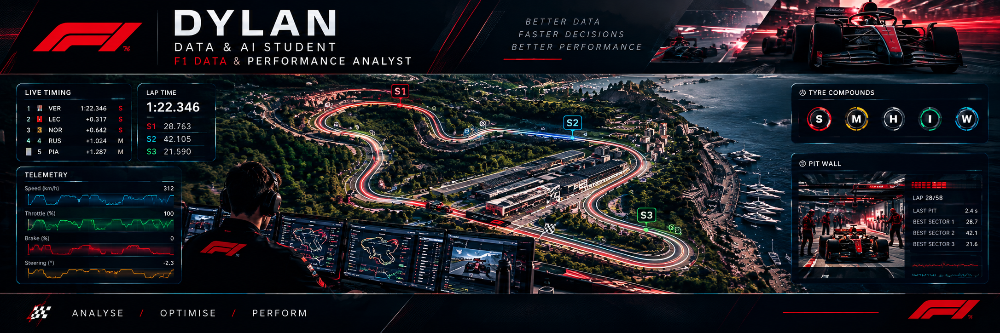

<p align="center">
  
</p>

<h1 align="center">Hi, I'm Dylan 👋</h1>

<p align="center">
  <strong>Data & AI Student · Aspiring F1 Data & Performance Analyst 🏎️</strong>
</p>

---

## 🏁 About Me

I'm a Bachelor 2 Data & AI student at HETIC, currently building my skills in data analysis, data visualization and machine learning.

My goal is to combine **Data, AI and my knowledge of Formula 1** to understand and analyse performance on and off the track.

- 🎓 Bachelor 2 Data & AI student at HETIC
- 📊 Interested in Data Analysis & Performance Analysis
- 🏎️ Passionate about Formula 1 and motorsport
- 🧠 Interested in race strategy, tyre management and performance
- 💻 Learning through real-world projects and F1 data
- 🚀 Building my F1 Data Analysis portfolio

---

## 📊 Data & AI Stack

| Area | Technologies |
|---|---|
| Programming | Python |
| Data Analysis | Pandas · NumPy |
| Visualization | Matplotlib · Seaborn · Plotly |
| Business Intelligence | Power BI · Excel |
| Database | SQL |
| Machine Learning | Scikit-learn |
| Tools | Git · GitHub |

---

## 🏎️ Formula 1 & Performance Analysis

I'm interested in using data to understand what happens on track.

- 🏁 Race & qualifying performance
- ⏱️ Lap time analysis
- 🛞 Tyre strategy & degradation
- ⛽ Race strategy
- 📡 Telemetry & race data
- 🟢 DRS & track position
- 🏎️ Driver & car performance
- 🔧 Technical regulations
- 🛠️ Pit stop strategy
- 📊 Pirelli tyre behaviour

---

## 🔬 Currently Learning

```text
APIs
Web Scraping
FastF1
Jolpica F1 API
Pandas
NumPy
Matplotlib
Seaborn
Plotly
Scikit-learn
Machine Learning
Advanced SQL
